# Portfolio Jenny Fernandez Garcia

Portfolio réalisé dans le cadre des cours d'architecture et ergonomie d'un site web. 

## Analyse / Audit

1. Objectif

    Présenter mon profil / Cv sous forme de site web afin d'attirer l'attention de futurs employeurs sur mon profil et mes compétences Web et gestion de projets.

2. Public visé

    Futurs employeurs et /ou lieux de stage

3. Slogan

    Jenny Fernadez Garcia - Web Developer Junior

4. Perspectives

    Carte de visite dans ma recherche "passive" d'emploi

5. Interlocuteurs

    - Nicole Lenoir: responsable du suivi des projets
    - Jury: responsable de la validation du projet

6. Langues

    J'ai choisi de le rédiger en **Français** et en **Anglais**. Il y aura donc une landing Page où il sera possible de choisir la langue du site. Il y aura également une icone dans la barre de navigation permettant de changer de langue sur n'importe quelle page. 

7. Inspirations

7. 1. Hanane
Lien: http://www.if3projets.net/wad23/hanane/

    • J’aime la possibilité de filtrer les différents projets
    • J’aime cette typo 
    • J’adore la couleur du fond
    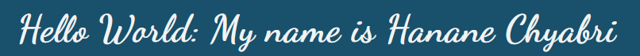
    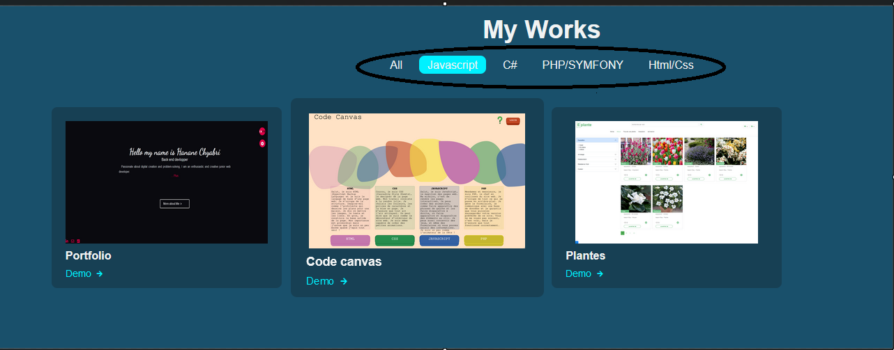

7. 2. Senem
Lien: http://www.if3projets.net/wad23/senem/apropros.html

    • J’aime le titre qui bouge
    • Les menus latéraux
    • L’aspect terminal

    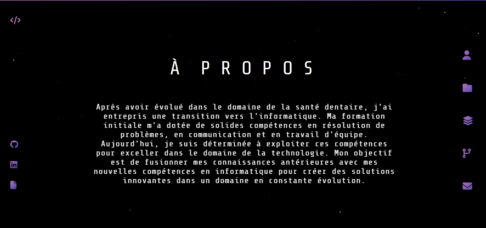

7. 3. Yusra
Lien: http://www.if3projets.net/wad23/yusra/#cont
    • J’aime l’avatar
    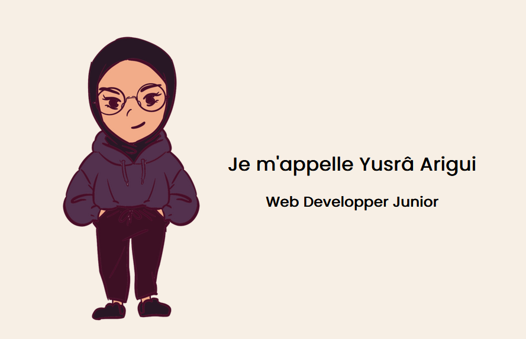

7. 4. Camille
Lien: http://www.if3projets.net/wad22/camille/
    • J’aime l’aspect ligne du temps pour l’XP
    • J’aime l’aspect dessiné des illus

    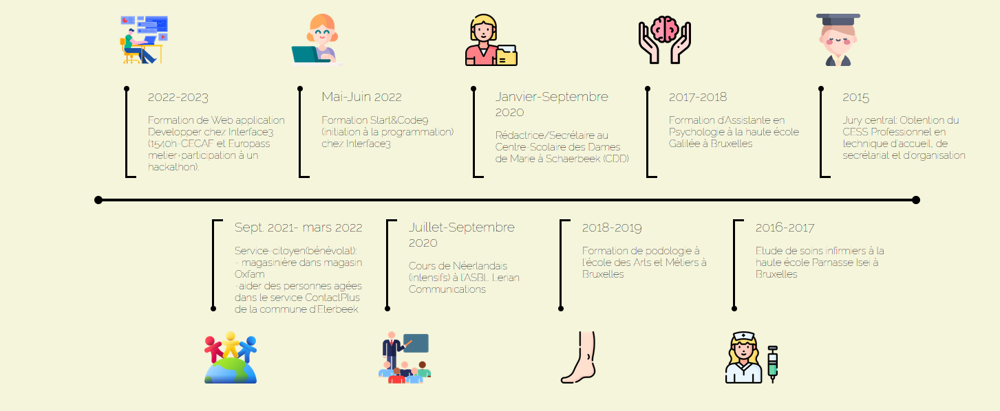
    

7. 5. Maya
        Lien: http://www.if3projets.net/wad22/maya/
        • J’aime l’animation d’accueil
        

7. 6. Menen
Lien: http://www.if3projets.net/wad22/menen/
    • J’aime cette couleur de fond : #f4ebd0

7. 7. Sara
Lien: http://www.if3projets.net/wad22/sara/
    • J’aime la typo (font-anim), me donne envie de trouver des typos de jeux de société bien connus / disney.
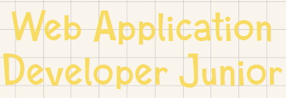
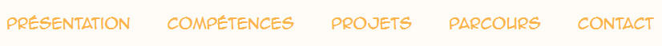

7. 8. Thao
Lien: http://www.if3projets.net/wad20/thao/
    • J’aime la présentation en hexagones (me fait penser à des tuile de jeu)
    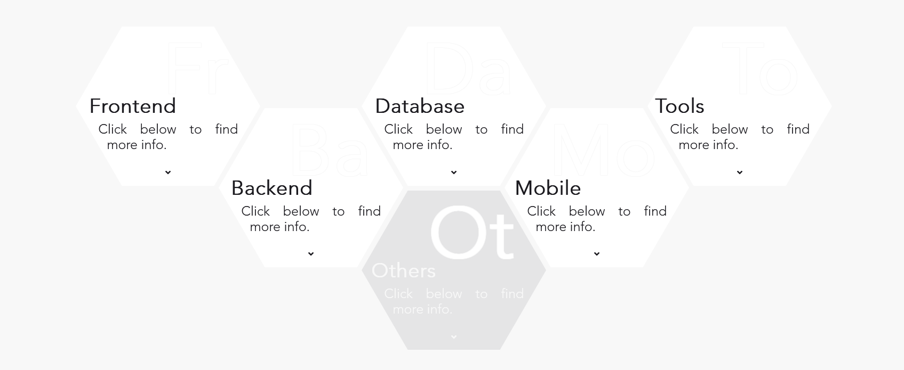

7. 9. Kelly
Lien: http://www.if3projets.net/wad20/kelly
    • J’aime le déplacement et la transition entre les pages (diagonale)

7.10. Libellud
Lien: https://www.libellud.com/univers-dixit/ (mon site préféré)
    • J’adore l’univers et les illus
    • Je souhaite reprendre l’idée des cartes pour les différentes rubriques
        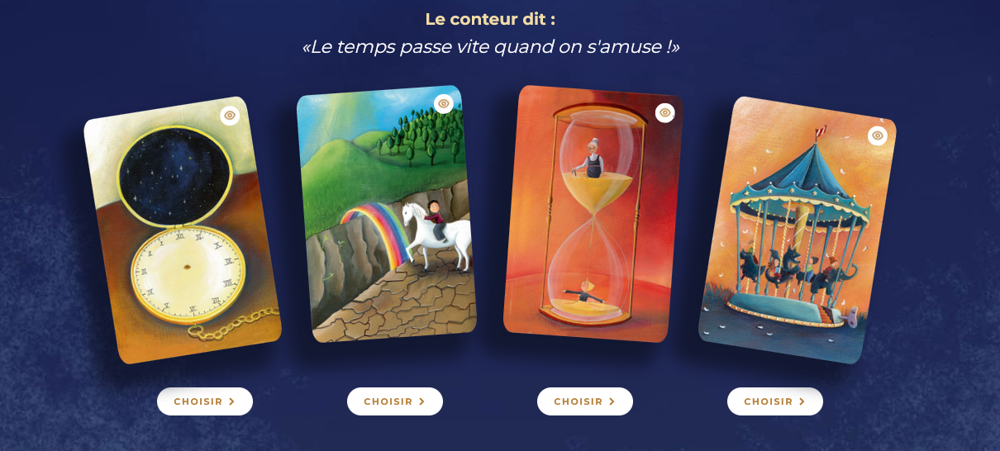
    • J’aime l’effet de fondu entre les différentes sections
        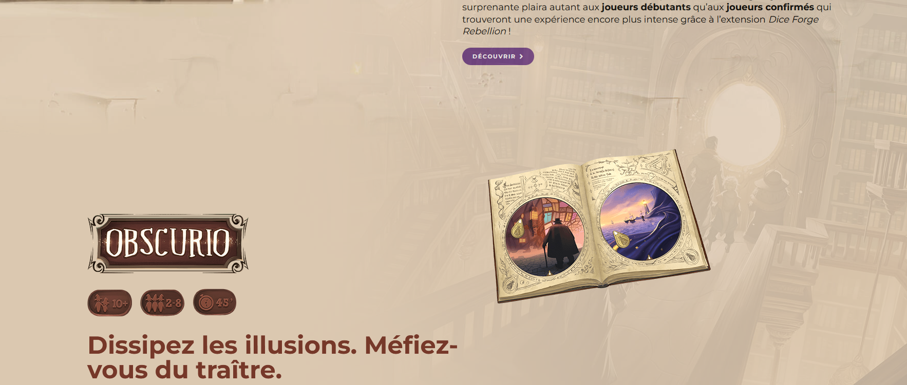  
    • J’aime le mélange entre le contenu fixe et certains éléments animés
        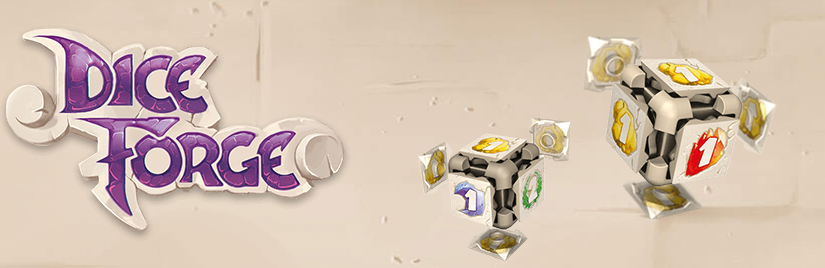

8. Fonctionnement du site et présentation du contenu

8. 1. Landing page: choix entre Français et Anglais
8. 2. Page d'accueil : Photo, brève description du profil et les différentes rubriques du site présentées sous forme de cartes à tirer, texte se s'affiche au hover des cartes.
    - Header avec rubriques, rétractable en menu burger (affichage que icone home et burger, au-dessus du menu latéral d'icônes).
    - Menu latéral transparent à gauche avec toutes les icones ( github, contact, changement de langue, Cv...)

8. 3. Rubriques
    Lorsqu'on choisit une rubrique: La carte prend toute la page et nous amène vers la page de contenu correspondant
    - About me : brève description de moi et mon parcours, plus mini jeux pour trouver les différents clins d'oeil aux jeux de société dans le site
    - Contact : formulaire de contact avec info pour recherche de stage
    - Parcours scolaire : ligne du temps avec un perso qui escalade une montagne (can't stop) pour aller d'un point à l'autre
    - Experience professionnelle: ligne du temps avec un perso qui escalade une montagne (can't stop) pour aller d'un point à l'autre. Lorsqu'on clique sur une section, un pop-up s'ouvre avec les infos complémentaires du poste
    - Compétences en Web Dev: les compétences web sont mises dans des tuiles en forme d'écailles de serpent (snake - akropolis). lorsqu'on clique dessus on arrive sur la liste filtrée des projets
    - Portfolio: liste filtrable en fonction technologies avec les différents projets réalisés

## Documents utiles

### Map du site

[Map](<../map/Business Plan Mind Map.pdf>)
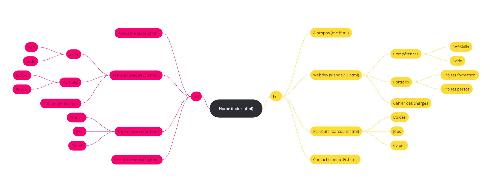

### Wireframe

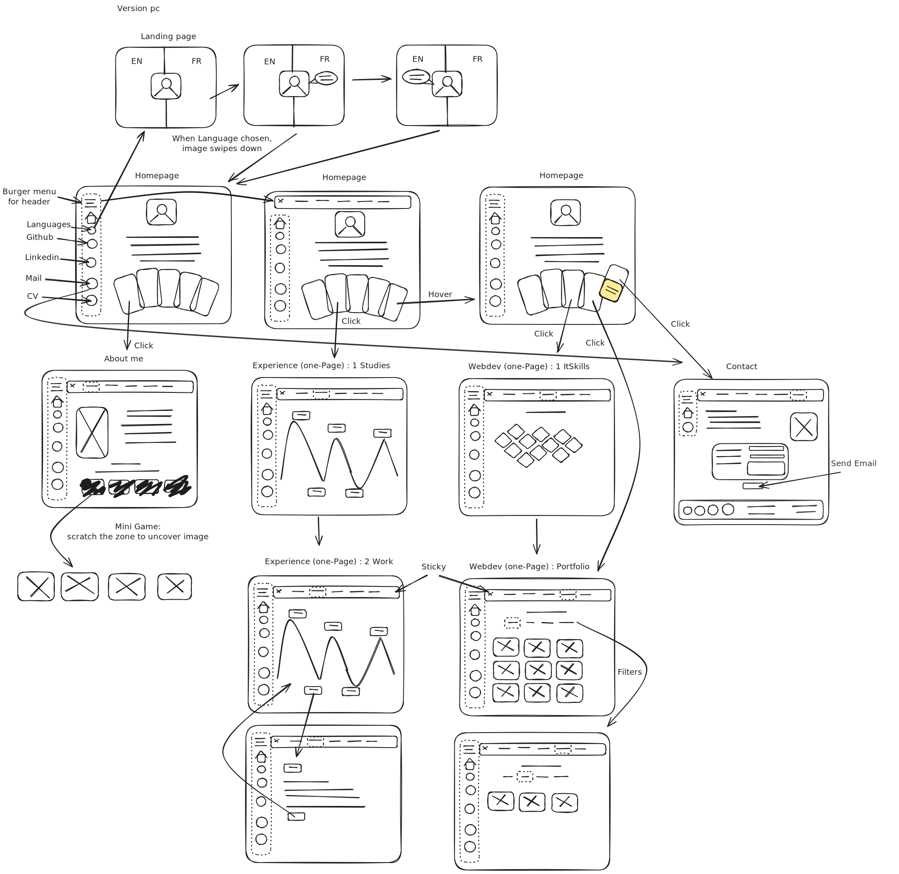

### Mock-up
<!-- Lien vers Figma -->

